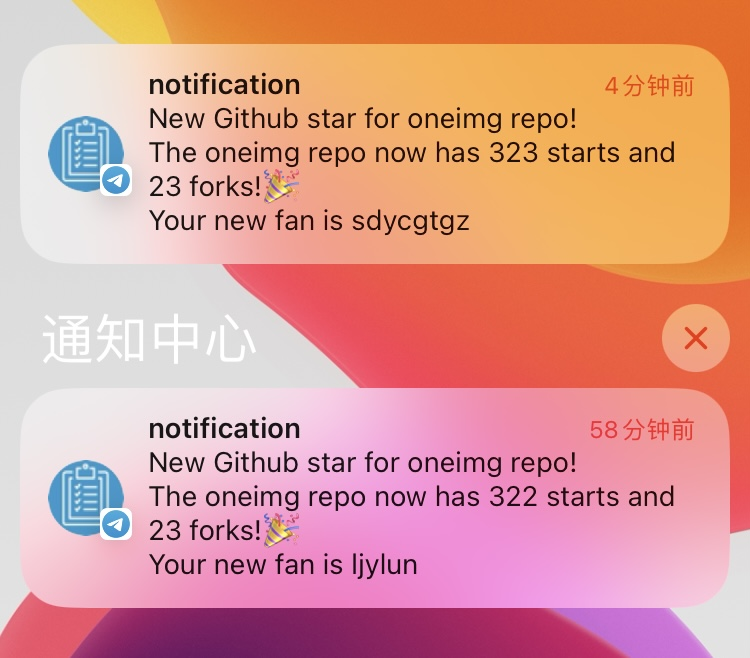
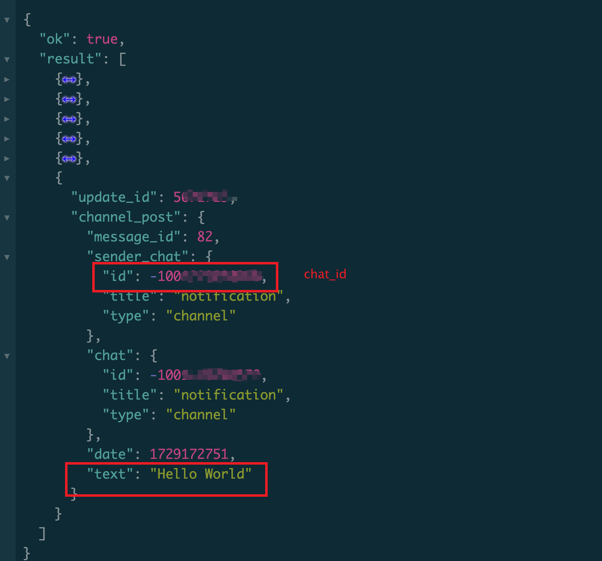
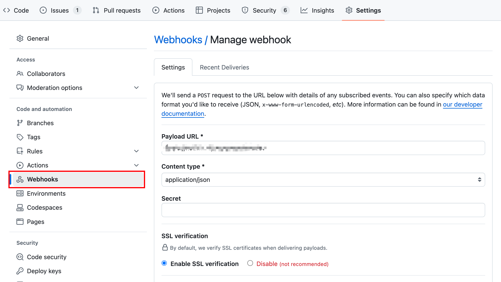
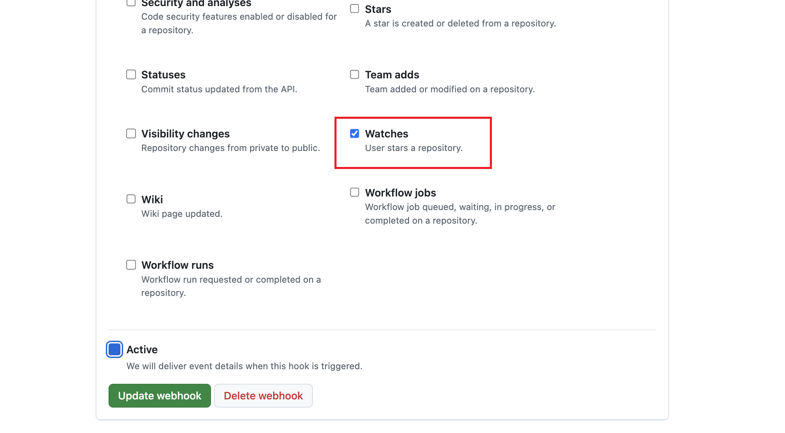
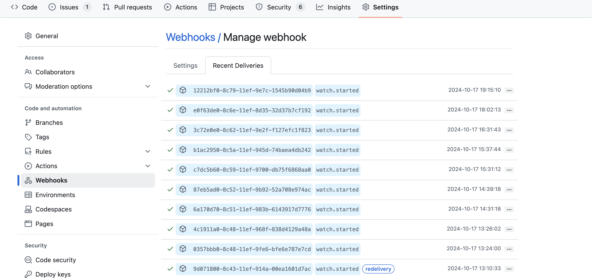

# Notifier

## 简介
利用 GitHub Webhooks、Cloudflare Workers 和 Telegram Bot 来实现当有人给 GitHub 项目加星（star）时，发送通知到 Telegram。

成功收到通知后会收到下面的信息。



## 原理
核心思路：Star 事件触发 → GitHub Webhooks → Cloudflare Workers → Telegram Bot API → 发送消息到 Telegram 频道/个人

1. 当某人给 GitHub 仓库加星（Star）时，GitHub 触发 Star 事件。

2. 利用 GitHub Webhooks 发送 HTTP POST 请求

    GitHub Webhooks 会将此 Star 事件的信息通过 HTTP POST 请求发送到你预先配置的 URL，这个 URL 指向的是 Cloudflare Worker 的地址。

3. 利用 Cloudflare Workers 处理请求：

    Cloudflare Worker 接收到 GitHub Webhook 的请求后，解析 Star 事件的详细信息（例如 Star 的用户、仓库名称等），并构建一条通知消息。

4. 调用 Telegram Bot API：

    Cloudflare Worker 使用 Telegram Bot API，调用 sendMessage 方法，将构建好的通知消息发送到你指定的 Telegram 频道或个人聊天中。

5. 通过 Telegram 频道接受新的 Star 通知。

具体实现：[index.js](./src/index.js)

以下是详细的步骤：

## 1. 创建 Telegram Bot 

这一步的目的是获取 Telegram Bot 的 `API Token`

1. 打开 Telegram，搜索 BotFather，然后发送 /start。
2. 使用 /newbot 命令来创建一个新机器人，并按照提示命名你的机器人。
3. 创建成功后，BotFather 会提供一个 `API Token`，记下这个 Token，后续会用到。

## 2. 创建 Telegram 频道或者群组

创建频道没什么好说的，主要是获取频道或者群组的 `chat_id`，后续会用到。

1. 将 Telegram Bot 邀请到你创建的个人频道或者群组中（使用 `username` 搜索 bot），并在群组中发送一条信息，比如 Hello World。
2. 在浏览器中访问地址 https://api.telegram.org/bot<Your_Bot_Token>/getUpdates，在结果中会看到你刚刚发送的信息，找到对应的 `chat_id` 即可（`chat_id` 为 -100 开头）。

    

## 3. 部署 Cloudflare worker

步骤：克隆该项目、安装依赖、配置环境变量以及部署应用到 cloudflare（键入部署命令后，会弹出授权登陆到 cloudflare 的网页）

```
# 克隆项目
git clone https://github.com/byodian/notifier

cd notifier

# 安装依赖
pnpm install

# 配置环境变量（密钥）
# 1. Telegram Bot API Token
npx wrangler secret put TELEGRAM_TOKEN

# 2. Channel chat_id
npx wrangler secret put TELEGRAM_CHAT_ID

# 部署 Cloudflare worker
pnpm run deploy
```

打开 Cloudflare 网站获取 Worker URL 后续会用到。

## 4. 配置 Github Webhooks

1. 前往你的开源 GitHub 仓库。
2. 点击 Settings > Webhooks > Add webhook。
3. 在 Payload URL 中填写 Cloudflare Worker 的 URL。
4. 在 Content type 选择 `application/json`。

    
5. 密钥 Secret 可选
5. 在 Which events would you like to trigger this webhook? 选择 Let me select individual events，然后勾选 Watches。
点击 Add webhook。

    

## 5. 测试和调试
1. 在 Github 上 Star 你的仓库

2. 观察 Cloudflare Worker 日志以及 Github 推送日志，在这些日志中你都能看到具体的请求和响应信息。

    

3. 在 Telegram 中查看是否收到 Star 通知。