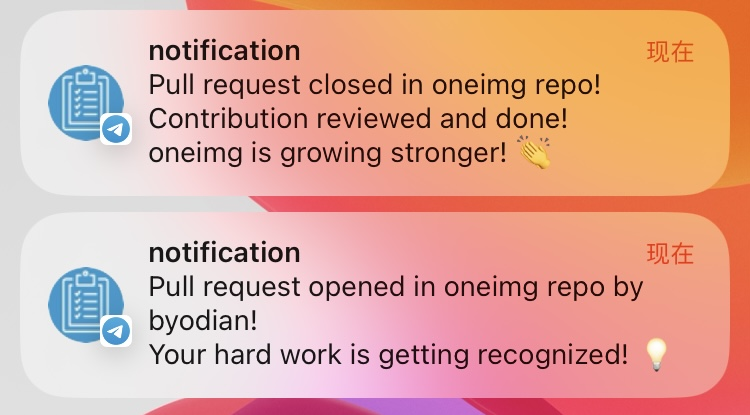

English | [中文](https://github.com/byodian/notifier/blob/main/README-zh.md)

## Introduction
Implement notifications to Telegram when GitHub repository star, issue, pull request, and fork events occur using GitHub Webhooks, Cloudflare Worker, and Telegram Bot.

The event notification styles are as follows

**Issue event message**


**Pull Request event message**



**Star event message**


**Fork event message**


**Stars milestone message**


## Future Plans
- [x] Configure Stars milestones, send congratulatory messages when milestones are reached
- [ ] ~~Optimize the issue of too many messages when events occur frequently~~ (Pseudo-requirement — If events are frequent, you can resolve this by turning off TG notifications)
- [ ] Add data statistics functionality, send statistical data periodically

## Principle
Core idea: Star event occurs → GitHub Webhooks → Cloudflare Workers → Telegram Bot API → Send message to Telegram channel/individual

1. When someone stars a GitHub repository, GitHub triggers a Star event.

2. Use GitHub Webhooks to send HTTP POST requests

    GitHub Webhooks will send the information of this Star event via an HTTP POST request to a pre-configured URL, which points to the address of a Cloudflare Worker.

3. Use Cloudflare Workers to process requests:

    After receiving the request from GitHub Webhook, the Cloudflare Worker parses the details of the Star event (e.g., the user who starred, repository name, etc.) and constructs a notification message.

4. Call Telegram Bot API:

    The Cloudflare Worker uses the Telegram Bot API, calling the sendMessage method to send the constructed notification message to your specified Telegram channel or personal chat.

5. Receive new Star notifications through the Telegram channel.

Specific implementation: [index.js](./src/index.js)

Here are the detailed steps:

## 1. Create a Telegram Bot

The purpose of this step is to obtain the `API Token` of the Telegram Bot

1. Open Telegram, search for BotFather, then send `/start`.
2. Use the `/newbot` command to create a new bot, and follow the prompts to name your bot.
3. After successful creation, BotFather will provide an `API Token`. Note down this Token, it will be used later.

## 2. Create a Telegram channel or group

There's not much to say about creating a channel, the main thing is to get the `chat_id` of the channel or group, which will be used later.

1. Invite the Telegram Bot to your created personal channel or group (search for the bot using its `username`), and send a message in the group, such as "Hello World".
2. Visit [https://api.telegram.org/bot<Your_Bot_Token>/getUpdates](https://api.telegram.org/bot<Your_Bot_Token>/getUpdates) in your browser. You will see the message you just sent in the results. Find the corresponding `chat_id` (the `chat_id` starts with -100).

    

## 3. Deploy Cloudflare worker

Steps: 
1. Clone the project
2. Install dependencies
3. configure environment variables
4. Deploy the application to Cloudflare (after entering the deployment command, a web page will pop up for authorization login to Cloudflare)

```
# Clone the project
git clone https://github.com/byodian/notifier

cd notifier

# Install dependencies
pnpm install

# Configure environment variables (secrets)
# 1. Telegram Bot API Token
npx wrangler secret put TELEGRAM_TOKEN

# 2. Channel chat_id
npx wrangler secret put TELEGRAM_CHAT_ID

# Deploy Cloudflare worker
pnpm run deploy
```

Configure GitHub Stars milestones in wrangler.toml
```
[vars]
MILESTONES = [10,50,100,500,1000,5000,100000]
```

Open the Cloudflare website to get the Worker URL, which will be used later.

## 4. Configure Github Webhooks

1. Go to your open-source GitHub repository.
2. Click Settings > Webhooks > Add webhook.
3. Fill in the Cloudflare Worker URL in the Payload URL.
4. Choose `application/json` for Content type.

    
5. Secret is optional
6. In "Which events would you like to trigger this webhook?", select "Let me select individual events", then check Stars, Issues, Pull Requests, and Forks.
Click Add webhook.

    

    

## 5. Testing and Debugging
1. Star your repository on Github

2. Observe the Cloudflare Worker logs and Github push logs. You can see specific request and response information in these logs.

    

3. Check if you received a Star notification in Telegram.